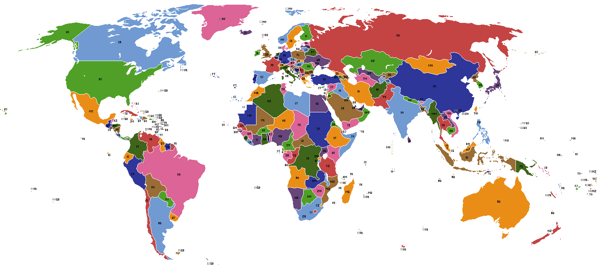

# dot-image

Convert images to dots

## Examples

### Map

Source: https://commons.wikimedia.org/wiki/File:World_map_political_ISO.png

### Bird

Source: https://commons.wikimedia.org/wiki/Commons:Quality_images#/media/File:Gull_portrait_ca_usa.jpg

